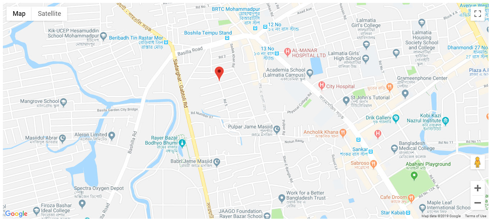
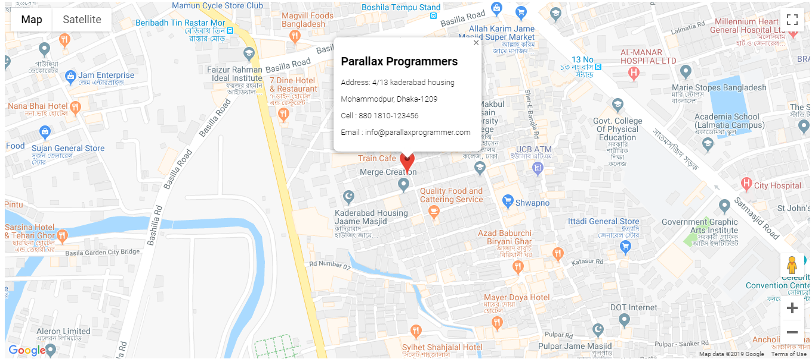

# Simple Google Maps With Marker
Simple google maps marker api with infowindow, Features included:
- Maps with marker
- Animation in marker
- Info Window in marker

## Required Changes

```
Set latitude and longitude for desired location
```

```
Set your google api key in "APP KEY"
```

```
Change infowindow content as you want to show in infowindow
```

### Demo Images


```

```


